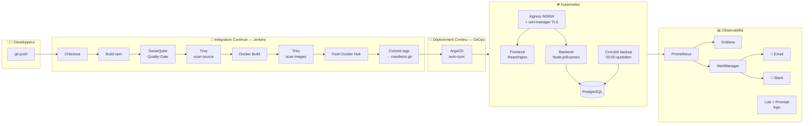

# Plateforme DevSecOps — Projet de Fin d'Études

Plateforme complète de déploiement et de supervision d'applications intégrant la sécurité à chaque étape du cycle de vie : **CI/CD automatisé, analyse de qualité, scan de vulnérabilités, GitOps, monitoring et alerting**.

> Une seule action (`git push`) déclenche : build → analyse qualité → scan sécurité → publication d'images → déploiement Kubernetes automatique. Aucune intervention manuelle.

---

## 🏗 Architecture



## 🧰 Stack technique

| Domaine | Outil | Rôle |
|---|---|---|
| Application | React + Vite / Node.js Express / PostgreSQL | Frontend, API REST, base de données |
| CI/CD | **Jenkins** (image custom : Node 20, Docker CLI, Trivy, sonar-scanner, argocd) | Orchestration du pipeline 7 étapes |
| Qualité de code | **SonarQube** LTS + Quality Gate bloquant | Analyse statique JS/CSS, webhook vers Jenkins |
| Sécurité | **Trivy** (scan filesystem + images, DB en cache local) | Détection CVE HIGH/CRITICAL, rapports JSON archivés |
| Registry | **Docker Hub** (`houssineguidara12/devsecops-*`) | Images taguées par numéro de build |
| GitOps | **ArgoCD** (auto-sync, selfHeal, prune) | Le cluster converge vers l'état déclaré dans git |
| Orchestration | **Kubernetes** (Docker Desktop) | Déploiements, Services, Ingress, CronJobs, RBAC, NetworkPolicy |
| HTTPS | **ingress-nginx + cert-manager** (ClusterIssuer selfsigned) | https://devsecops.local, redirection HTTP→HTTPS |
| Monitoring | **Prometheus** (+ file_sd dynamique), **Grafana**, node-exporter, cAdvisor, postgres-exporter, kube-state-metrics | Métriques système, conteneurs, base et application |
| Logs | **Loki + Promtail** | Agrégation centralisée des logs conteneurs |
| Alerting | **AlertManager** → Email (Gmail SMTP) + Slack (webhook) | Routage par sévérité (critical/warning), inhibition |
| Secrets | **HashiCorp Vault** | Gestion centralisée des secrets |
| Sauvegarde | CronJob Kubernetes + PVC | Dump PostgreSQL quotidien, rétention 7 jours |

## 🔄 Pipeline CI/CD (Jenkinsfile)

| # | Étape | Détail |
|---|---|---|
| 1 | **Git Checkout** | Récupération du code depuis GitHub |
| 2 | **Build** | `npm ci` backend + frontend, build Vite production |
| 3 | **SonarQube Analysis + Quality Gate** | Analyse statique ; le pipeline **échoue si le gate échoue** (webhook temps réel) |
| 4 | **Trivy — scan source** | Vulnérabilités HIGH/CRITICAL dans les dépendances (lockfiles) |
| 5 | **Docker Build + Trivy — scan images** | Build des 2 images, scan OS + packages, rapports JSON archivés |
| 6 | **Docker Push** | Publication sur Docker Hub avec tag = numéro de build + `latest` |
| 6bis | **Update Manifests (GitOps)** | Le pipeline committe le nouveau tag dans `kubernetes/manifests/` → git est la source de vérité |
| 7 | **Deploy** | `argocd app sync` (retry 3×) — ArgoCD fait converger le cluster, les pods roulent sans interruption |

**Preuve de fonctionnement** : build #19 — 13 étapes vertes en ~3,5 min, pods redéployés automatiquement en image `:19`, application `Synced + Healthy` dans ArgoCD.

## 📋 Conformité au cahier des charges

| Exigence | Implémentation | Preuve |
|---|---|---|
| Pipeline CI/CD 7 étapes | `Jenkinsfile` (13 stages dont GitOps) | Build #19 100 % vert |
| Analyse qualité (SonarQube) | Projet `devsecops-pfe`, Quality Gate bloquant | http://localhost:9000 |
| Scan sécurité (Trivy) | Source + images, seuils HIGH/CRITICAL | 15 CVE HIGH détectées et rapportées |
| Registry d'images | Docker Hub, tags immuables par build | `houssineguidara12/devsecops-*` |
| Déploiement GitOps (ArgoCD) | auto-sync + selfHeal + prune, commits « Jenkins CI » | http://localhost:30088 |
| Orchestration Kubernetes | 15+ manifests : Deployments, Services, Ingress, CronJob, RBAC, NetworkPolicy | namespace `devsecops-platform` |
| HTTPS/TLS | ingress-nginx + cert-manager, certificat `devsecops-tls` | https://devsecops.local |
| Monitoring temps réel | Prometheus + Grafana + 5 exporters + cibles dynamiques (file_sd) | http://localhost:4001 |
| Alerting Email/Slack | AlertManager, routes par sévérité, `send_resolved` | Alertes testées et reçues |
| Gestion des secrets | Vault (dev mode) + Jenkins credentials store + gitignore des fichiers sensibles | Push bloqué par GitHub secret scanning → corrigé |
| Sauvegarde BDD | CronJob `postgres-backup` 02:00, PVC 5 Gi, rétention 7 j | Job testé : backup 1,5 K en 11 s |
| Provisioning de serveurs | Formulaire web → conteneur node-exporter → **auto-enregistré dans Prometheus** | Cibles `dynamic-servers` |

## 🌐 Accès aux services

| Service | URL | Identifiants |
|---|---|---|
| Application (HTTPS) | https://devsecops.local | — |
| Jenkins | http://localhost:8090 | admin / *(local)* |
| ArgoCD | http://localhost:30088 | admin / *(voir gestionnaire de secrets)* |
| SonarQube | http://localhost:9000 | admin / *(modifié)* |
| Grafana | http://localhost:4001 | admin / *(voir .env)* |
| Prometheus (compose) | http://localhost:9091 | — |
| AlertManager (compose) | http://localhost:9094 | — |
| Vault | http://localhost:8200 | token dev |
| Adminer (BDD) | http://localhost:8080 | postgres |

## 🚀 Démarrage rapide

```bash
# 1. Stack Docker Compose (app + monitoring + CI)
docker compose up -d --build

# 2. Kubernetes : ArgoCD déploie automatiquement depuis ce dépôt
kubectl apply -n argocd -f kubernetes/argocd/project.yaml
kubectl apply -n argocd -f kubernetes/argocd/application.yaml

# 3. Résolution du domaine local (PowerShell admin)
Add-Content C:\Windows\System32\drivers\etc\hosts "127.0.0.1 devsecops.local"

# 4. Lancer le pipeline : Jenkins → devsecops-pipeline → Build Now
#    (ou simplement pousser un commit)
```

## 📁 Structure du dépôt

```
├── Jenkinsfile                 # Pipeline CI/CD (13 stages)
├── docker-compose.yml          # Stack locale : app + monitoring + Jenkins + SonarQube + Vault
├── sonar-project.properties    # Configuration analyse SonarQube
├── app/
│   ├── backend/                # API Node.js/Express (health, metrics, auto-deploy, webhook alertes)
│   ├── frontend/               # React + Vite, servi par nginx (proxy /api)
│   └── database/               # Schéma SQL + seed
├── jenkins/Dockerfile          # Image Jenkins custom (Node, Docker, Trivy, sonar-scanner, argocd)
├── kubernetes/
│   ├── manifests/              # Source de vérité GitOps (surveillée par ArgoCD)
│   ├── argocd/                 # AppProject + Application
│   └── cert-manager/           # ClusterIssuers (selfsigned + Let's Encrypt)
└── monitoring/
    ├── prometheus/             # Config + règles d'alerte + cibles dynamiques (file_sd)
    ├── alertmanager/           # Routage email/Slack (credentials hors git)
    ├── grafana/                # Datasources + dashboards provisionnés
    └── promtail/               # Expédition des logs vers Loki
```

## 🔐 Sécurité — mesures notables

- **Quality Gate bloquant** : un code de mauvaise qualité ne peut pas être déployé
- **Double scan Trivy** (source puis images) avec base de vulnérabilités mise en cache
- **Secrets hors git** : `alertmanager.yml` gitignoré (template `.example` fourni), credentials dans le store Jenkins, blocage vérifié par GitHub push protection
- **Conteneurs non-root** (frontend nginx, backend node), **NetworkPolicies**, **RBAC** Kubernetes
- **HTTPS obligatoire** : redirection 308 HTTP→HTTPS via l'ingress
- **Tags d'images immuables** : chaque déploiement est traçable jusqu'au commit git qui l'a produit

---

*Projet de fin d'études — Ingénierie DevSecOps, 2026.*
